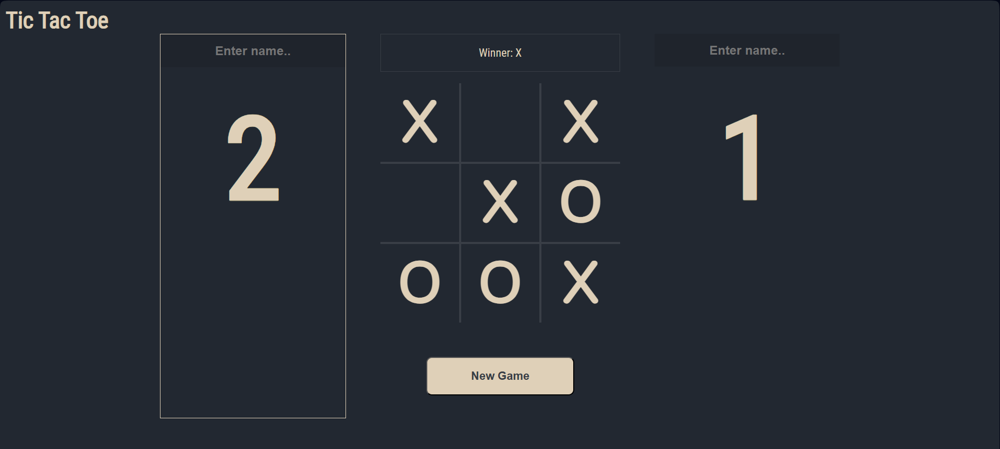

# Tic Tac Toe
Classic Tic Tac Toe game built from scratch using HTML, CSS, and JavaScript. 

This project is part of [The Odin Project's Full Stack Javascript path](https://www.theodinproject.com/paths/full-stack-javascript) and demonstrates the use of factory functions and the module pattern. 

## Screenshot


## Features
- Two-player turn-based gameplay
- Accessible game board using keyboard or mouse
- Scores tracked with visual indicators
- Current player highlighting
- Responsive design with hover effects

## Technologies
- HTML5
- CSS (Grid for game board, Flexbox for layout, custom styling)
- JavaScript (module pattern, factor functions, event delegation)

## Fonts
- [Roboto Condensed](https://fonts.google.com/specimen/Roboto+Condensed)
- [Nunito](https://fonts.google.com/specimen/Nunito)

## Installation
1. Clone the repository
2. Navigate to the project folder: ```cd tic-tac-toe```
3. Open index.html in any modern browser

## Live Demo
A live demo is available here: [Tic Tac Toe App](https://keegan-george.github.io/tic-tac-toe/)

## Architecture
GameBoard - manages board state and win conditions
DisplayController - handles all DOM updates
GameController - wires user events to game logic
Player factory - encapsulates player data
